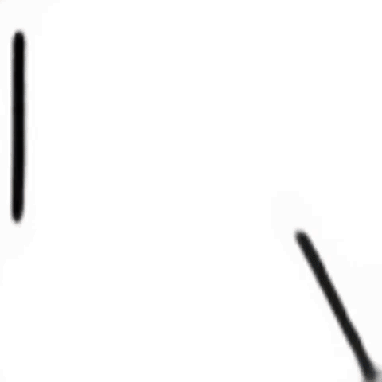
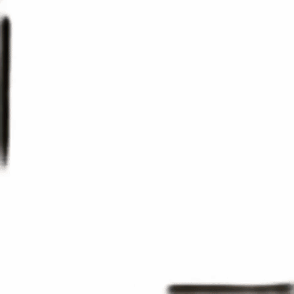
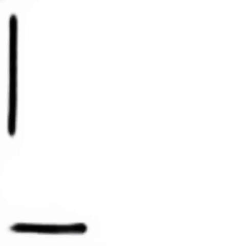
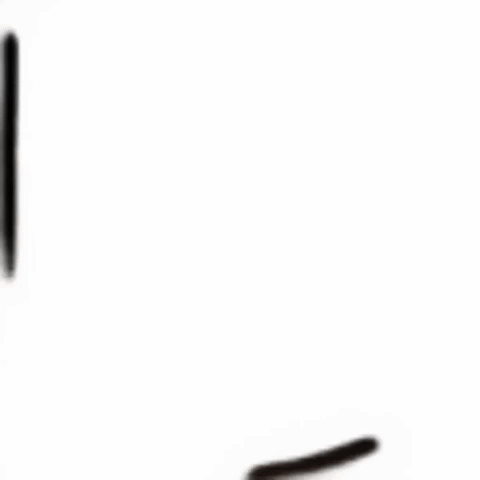
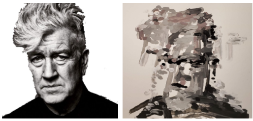

# Content Masked Loss 

Peter Schaldenbrand, Jean Oh<br/>
Carnegie Mellon University<br/>
2021

## AAAI'21 [arXiv pre-print](https://arxiv.org/abs/2012.10043)

Human-Like Brush Stroke Planning in a Reinforcement Learning Painting Agent. 


## *** If you are interested in Robot Painting, we highly recommend using our newer work, FRIDA: [https://github.com/pschaldenbrand/Frida](https://github.com/pschaldenbrand/Frida)


Content Masked Loss is an enhancement to the reward function in a reinforcement learning model that learns to paint in a manner that is more similar to how humans paint than existing state-of-the-art methods.  The algorithm converts an image into a series of paint brush instructions.  The model receives the most reward when painting in regions that contain important features such as eyes, mouths, edges, etc.


## Content Masked Loss Results

| Baseline      | Ours |
| :----: | :----: |
| L2      | Content Masked Loss     |
|    |         |
|    |         |


## Robot Painting
The brush stroke instructions can be fed to an [Arduino Braccio](https://store.arduino.cc/usa/tinkerkit-braccio) robotic arm to be painted onto a canvas.  [Robot Arduino code is available here](https://create.arduino.cc/editor/skeeter_man/c5805760-4e8c-48e7-898d-a6abf2ed9097/preview)


Generate the stroke instructions then have your robot arm paint them to have results like this:



### Download Pre-Trained Models
The actor and renderer models can be downloaded from this box account.
https://cmu.box.com/s/ojydzfocwjhbm4tsjbgt4ju5uwd6013c

### Generating Strokes for Robot Painting Arm
Run the `generate_actions.py` script on your desired image, and the brush stroke instructions will be found in .csv files in a directory named /arduino_actions.
```
$ python generate_actions.py --img=[image to paint] --max_step=[number of brush strokes] \
--actor=pretrained_models/cml1/actor.pkl --renderer=renderer_constrained.pkl
```
### Run Arduino Braccio Code
The load the Arduino with [code from here](https://create.arduino.cc/editor/skeeter_man/c5805760-4e8c-48e7-898d-a6abf2ed9097/preview).
### Send the instructions to the Robot Arm
A python program parses the brush stroke instruction csv files and sends them to the robot arm:
```
$ python arduino_paint.py
```
By default, this script sends the instructions from `arduino_actions/actions_all.csv`, but it can be changed to a file of your choice with command-line argument `--instructionsfile`

See [AniPainter](https://github.com/pschaldenbrand/AniPainter) for more robot painting fun!

## Train the model yourself
Monitor the training progress using: `$ tensorboard --logdir=train_log --port=6006`
### Train Neural Renderer
```
$ python train_renderer.py --constrained=True
```
### Train the Actor
Download the training data using `RobotPainter.ipynb` then run:
```
$ python train.py --debug --batch_size=8 --max_step=120 --renderer=renderer.pkl --resume=pretrained_models/[gan|l1|l2|cm|cml1] --loss_fcn=[gan|l1|l2|cm|cml1]
```


### Acknowledgement 
We used the [code](https://github.com/megvii-research/ICCV2019-LearningToPaint) from [Huang et al. 2019](https://arxiv.org/abs/1903.04411) as starter code for this project.

Frechet Inception Distance code from [Heusel et al. 2017](https://github.com/bioinf-jku/TTUR)
