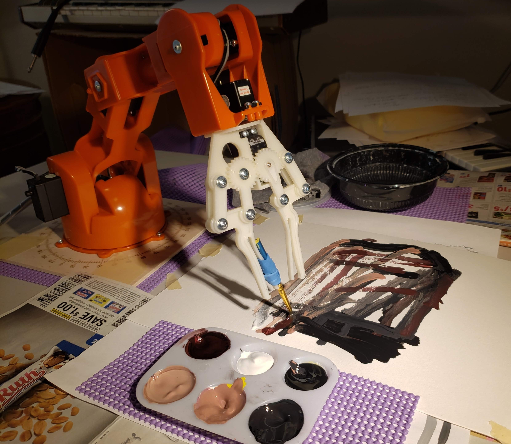
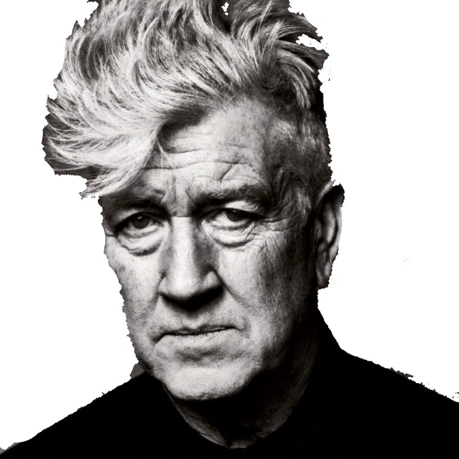
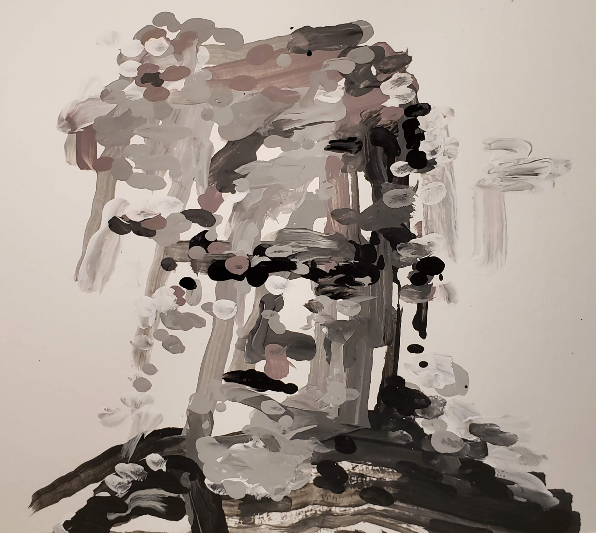

# Humanoid Painter
Humanoid Painter is a reinforcement learning algorithm that learns to paint in a manor that is more similar to how humans paint than existing state-of-the-art methods.  The algorithm converts an image into a series of paint brush instructions.  The model receives the most reward when painting in regions that contain important features such as eyes, mouths, edges, etc.

The brush stroke instructions can be fed to an [Arduino Braccio](https://store.arduino.cc/usa/tinkerkit-braccio) robotic arm to be painted onto a canvas.




## Robot Painting
Generate the stroke instructions then have your robot arm paint them to have results like this:


### Download Pre-Trained Models
The actor and renderer models can be downloaded from this box account.
https://cmu.box.com/s/ojydzfocwjhbm4tsjbgt4ju5uwd6013c

### Generating Strokes for Robot Painting Arm
Run the `generate_actions.py` script on your desired image, and the brush stroke instructions will be found in .csv files in a directory named /arduino_actions.
```
$ python generate_actions.py --img=[image to paint] --max_step=[number of brush strokes] \
--actor=pretrained_models/cml1/actor.pkl --renderer=renderer_constrained.pkl
```
### Run Arduino Braccio Code
The load the Arduino with `paint.ino`.
### Send the instructions to the Robot Arm
A python program parses the brush stroke instruction csv files and sends them to the robot arm:
```
$ python arduino_paint.py
```
By default, this script sends the instructions from `arduino_actions/actions_all.csv`, but it can be changed to a file of your choice with command-line argument `--instructionsfile`

## Train the model yourself
Monitor the training progress using: `$ tensorboard --logdir=train_log --port=6006`
### Train Neural Renderer
```
$ python train_renderer.py --constrained=True
```
### Train the Actor
Download the training data using `RobotPainter.ipynb` then run:
```
$ python train.py --debug --batch_size=8 --max_step=120 --renderer=renderer.pkl --resume=pretrained_models/[gan|l1|l2|cm|cml1] --loss_fcn=[gan|l1|l2|cm|cml1]
```